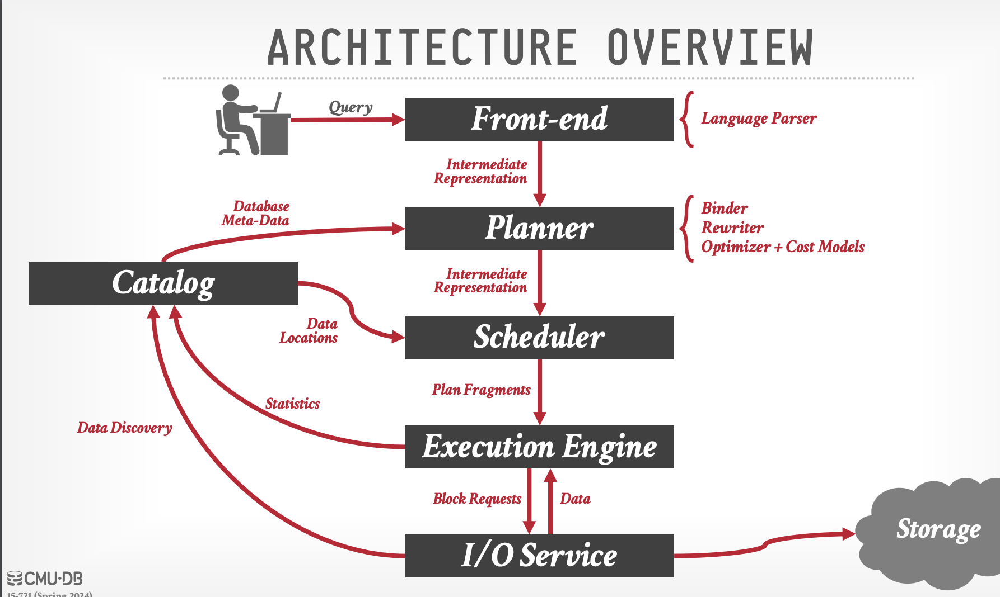

# CMU OLAP Database Overview

## Lecture 1: Evolution of Database Architectures

### Evolution Timeline
- **Early 2000s**
  - Introduction of Shared Nothing Architecture
  - Emergence of Postgres Forks
  - Adoption of Encoded Storage Techniques

- **2010**
  - Shift towards Shared Disk Engines
  - Dependence on Third-Party Distributed Storage Solutions

- **2020**
  - Rise of LakeHouse Systems
  - Middleware enhancements for data lakes, improving schema control and versioning

### Query Flow Architecture
The architecture of query flow in a database management system (DBMS) involves several key components:
- **Front-end**: Interprets user queries into an intermediate representation.
- **Planner**: Converts the intermediate representation into a query plan, utilizing binders, rewriters, optimizers, and a cost model.
- **Scheduler**: Organizes worker nodes and schedules execution by dividing the query plan into fragments.
- **Execution Engine**: Executes the plan fragments.
- **I/O Service**: Manages block requests from the execution engine, retrieving requested data from the object store.
- **Catalog**: Maintains data locations and metadata, facilitating communication across all DBMS components except the front-end.

### Data Classification
Data within a DBMS is categorized into:
- **Persistent Data**: The primary source of records for the database.
- **Intermediate Data**: Temporary artifacts generated by query operators, used by subsequent operators in the query execution process.

### OLAP Queries in Distributed DBMS
OLAP queries form an acyclic graph of physical operators, with the DBMS optimizing data flow from input to output across distributed systems.

### Distributed System Architecture
The architecture of a distributed DBMS defines the storage location of persistent data files, influencing node coordination. There are two primary data access strategies:
- **Push Query to Data**: Queries are sent to the node storing the relevant data, minimizing data transmission by processing data locally.
- **Pull Data to Query**: Data is transferred to the node executing the query, necessary when the data's location lacks compute resources.
